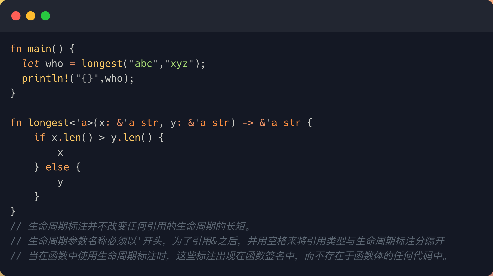

<link href="https://google-fonts.mirrors.sjtug.sjtu.edu.cn/css2?family=Liu+Jian+Mao+Cao&family=Noto+Sans+SC&display=swap" rel="stylesheet">
<link rel="stylesheet" href="hgz.css">
<style>
body {
    font-family: 'Noto Sans SC', sans-serif;
}
</style>


本文中的外网机子A和内网机子B均为Ubuntu系统.

<div class="animated-box">
    <h1>内网穿透</h1>
</div>

# 下载
```shell
wget https://github.com/fatedier/frp/releases/download/v0.54.0/frp_0.54.0_linux_amd64.tar.gz
```
# 外网机子A
```shell
tar xzvf frp_0.54.0_linux_amd64.tar.gz
cd frp_0.54.0_linux_amd64
vim frps.toml
    bind_port = 7000
    tls_enable = true
./frps -c frps.toml
```

# 内网机子B
```shell
tar xzvf frp_0.54.0_linux_amd64.tar.gz
cd frp_0.54.0_linux_amd64
vim frps.toml
    serverAddr = "sh.cirray.cn"
    serverPort = 7000

    [[proxies]]
    name = "ssh"
    type = "tcp"
    localIp = "127.0.0.1"
    localPort = 22
    remotePort = 7022

    [[proxies]]
    name = "mysql"
    type = "tcp"
    localIp = "127.0.0.1"
    localPort = 3306
    remotePort = 7306
./frpc -c frpc.toml
```

# 开机自启systemd
以内网机子B为例
```shell
sudo vim /etc/systemd/system/frps.service
    [Unit]
    Description = frp client
    After = network.target

    [Service]
    Type = simple
    ExecStart = /usr/bin/frpc -c /etc/frp/frpc.toml
    Restart=on-failure
    RestartSec=10s

    [Install]
    WantedBy = multi-user.target
sudo systemctl daemon-reload
sudo systemctl enable frpc
sudo systemctl restart frpc
```
## 图片呢

